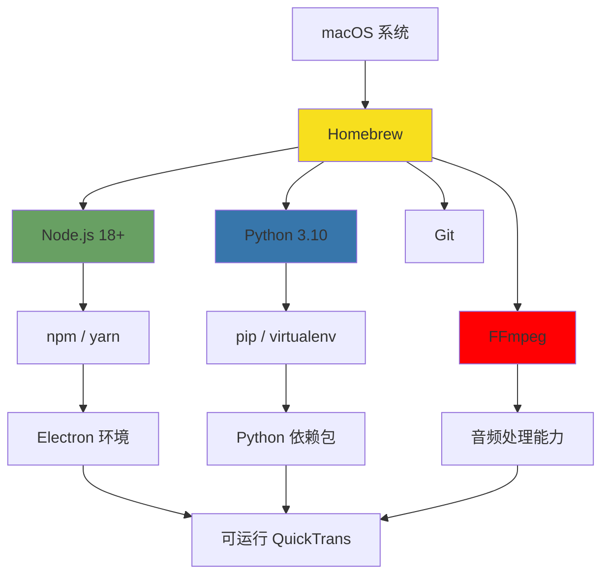

# QuickTrans 开发环境配置指南 (macOS)

> 本文档详细说明在 macOS 系统上搭建 QuickTrans 开发环境的完整流程
>
> **更新说明：** v2.0 新增离线多语言翻译功能

---

## 目录

1. [系统要求](#1-系统要求)
2. [必需软件清单](#2-必需软件清单)
3. [分步安装指南](#3-分步安装指南)
4. [环境变量配置](#4-环境变量配置)
5. [验证安装](#5-验证安装)
6. [常见问题排查](#6-常见问题排查)
7. [性能优化建议](#7-性能优化建议)
8. [功能测试指南](#8-功能测试指南)

---

## 1. 系统要求

### 1.1 硬件配置

| 组件 | 最低配置 | 推荐配置 | 说明 |
|------|----------|----------|------|
| **操作系统** | macOS 11 (Big Sur) | macOS 13 (Ventura) 或更高 | ARM64 架构优先 |
| **处理器** | Intel Core i5 / Apple M1 | Apple M2 / M3 或 Intel i7+ | ARM 架构推理速度提升 3-5x |
| **内存** | 8 GB | 16 GB 或更多 | 中等模型需要 ~2GB 内存 |
| **存储** | 20 GB 可用空间 | 50 GB SSD | 用于模型文件和依赖包 |
| **网络** | 稳定宽带 | 稳定宽带 | 首次需下载 ~3GB 模型 |

### 1.2 软件依赖关系图



---

## 2. 必需软件清单

### 2.1 核心软件列表

| 序号 | 软件名称 | 版本要求 | 用途 | 安装方式 | 文件大小 |
|------|----------|----------|------|----------|----------|
| 1 | **Homebrew** | 最新版 | macOS 包管理器 | 官方脚本 | ~10 MB |
| 2 | **Node.js** | ≥ 18.17.0 (推荐 LTS 20.x) | 运行 Electron 和前端 | Homebrew | ~40 MB |
| 3 | **Python** | 3.10 或 3.11 | AI 引擎运行时 | Homebrew | ~80 MB |
| 4 | **Git** | ≥ 2.30 | 版本控制 | Homebrew / Xcode | ~50 MB |
| 5 | **FFmpeg** | ≥ 5.0 | 音频提取与处理 | Homebrew | ~60 MB |
| 6 | **Xcode Command Tools** | 最新版 | 编译工具链 | 官方安装器 | ~2 GB |

### 2.2 Python 依赖包

虚拟环境安装后自动安装：

| 包名 | 版本要求 | 用途 | 安装大小 |
|------|----------|------|----------|
| `faster-whisper` | ≥ 1.0.0 | Whisper 推理引擎 | ~50 MB |
| `torch` | ≥ 2.0.0 | 深度学习框架 | ~1.5 GB (含 CUDA) |
| `transformers` | ≥ 4.30 | 通用 AI 模型库 | ~200 MB |
| `fastapi` | ≥ 0.100 | Python Web 框架 | ~5 MB |
| `uvicorn` | ≥ 0.22 | ASGI 服务器 | ~2 MB |
| `pydantic` | ≥ 2.0 | 数据验证库 | ~3 MB |
| `numpy` | ≥ 1.24 | 数值计算库 | ~20 MB |
| `opencc` | ≥ 1.1 | 繁简转换 | ~10 MB |

### 2.3 Node.js 依赖包

项目安装后自动安装：

| 包名 | 用途 |
|------|------|
| `electron` | Electron 框架核心 |
| `electron-forge` | Electron 打包工具 |
| `react` + `react-dom` | UI 框架 |
| `typescript` | 类型系统 |
| `tailwindcss` | 样式框架 |
| `better-sqlite3` | SQLite 数据库 |
| `node-pty` | 进程管理 |
| `electron-better-ipc` | IPC 通信增强 |

---

## 3. 分步安装指南

### 3.1 安装 Homebrew（包管理器）

**作用**：简化 macOS 软件安装，类似 Linux 的 apt-get

```bash
# 1. 打开终端（Terminal），执行官方安装脚本
/bin/bash -c "$(curl -fsSL https://raw.githubusercontent.com/Homebrew/install/HEAD/install.sh)"

# 2. 安装过程中会提示输入密码（输入 macOS 登录密码，不会显示字符）

# 3. 安装完成后，配置环境变量（Apple Silicon 芯片需要）
echo 'eval "$(/opt/homebrew/bin/brew shellenv)"' >> ~/.zprofile
eval "$(/opt/homebrew/bin/brew shellenv)"

# 4. 验证安装
brew --version
```

**预期输出**：
```
Homebrew 4.x.x
```

**故障排查**：
- 如果提示 `command not found: brew`，关闭终端重新打开
- Apple Silicon 用户注意路径为 `/opt/homebrew`，Intel 为 `/usr/local`

---

### 3.2 安装 Xcode Command Line Tools

**作用**：提供编译工具链（gcc、make 等），Python 的某些包需要编译

```bash
# 方法 1：通过 Homebrew 安装（推荐）
brew install --cask xcode-command-line-tools

# 方法 2：直接安装（如果方法 1 失败）
xcode-select --install

# 会弹出安装对话框，点击"安装"按钮，等待完成

# 验证安装
xcode-select -p
```

**预期输出**：
```
/Library/Developer/CommandLineTools
```

---

### 3.3 安装 Git

**作用**：克隆项目代码、版本管理

```bash
# 安装 Git
brew install git

# 验证安装
git --version
```

**配置 Git（可选）**：
```bash
git config --global user.name "Your Name"
git config --global user.email "your.email@example.com"
```

---

### 3.4 安装 Node.js

**作用**：运行 Electron 和前端 React 代码

```bash
# 安装 Node.js LTS 版本（推荐 20.x）
brew install node@20

# 创建符号链接（如果需要）
echo 'export PATH="/opt/homebrew/opt/node@20/bin:$PATH"' >> ~/.zshrc
source ~/.zshrc

# 验证安装
node --version
npm --version
```

**预期输出**：
```
v20.x.x
10.x.x
```

**配置 npm 镜像（可选，加速国内下载）**：
```bash
# 使用淘宝镜像
npm config set registry https://registry.npmmirror.com

# 验证
npm config get registry
```

---

### 3.5 安装 Python

**作用**：运行 Faster-Whisper AI 引擎

```bash
# 安装 Python 3.11（推荐版本，与 PyTorch 兼容性最好）
brew install python@3.11

# 验证安装
python3.11 --version

# 创建软链接（可选，方便使用）
ln -s -f /opt/homebrew/bin/python3.11 /usr/local/bin/python3
```

**预期输出**：
```
Python 3.11.x
```

**安装 pip 和虚拟环境工具**：
```bash
# 升级 pip
python3.11 -m pip install --upgrade pip

# 安装 virtualenv
python3.11 -m pip install virtualenv

# 验证
virtualenv --version
```

---

### 3.6 安装 FFmpeg

**作用**：音频提取和格式转换

```bash
# 安装 FFmpeg
brew install ffmpeg

# 验证安装
ffmpeg -version
```

**预期输出**：
```
ffmpeg version 6.x.x Copyright (c) 2000-2024 the FFmpeg developers
```

---

### 3.7 克隆项目并安装依赖

#### 3.7.1 克隆项目代码

```bash
# 克隆仓库（替换为实际地址）
git clone https://github.com/your-org/QuickTrans.git
cd QuickTrans

# 查看项目结构
ls -la
```

#### 3.7.2 安装 Node.js 依赖

```bash
# 进入项目根目录
cd QuickTrans

# 安装依赖
npm install

# 如果安装失败，尝试清除缓存
npm cache clean --force
npm install

# 验证安装
ls node_modules | head -10
```

**安装过程中可能遇到的问题**：

| 问题 | 解决方案 |
|------|----------|
| `gyp ERR!` 需要编译 `better-sqlite3` | 确保 Xcode Command Tools 已安装 |
| 权限错误 | 使用 `sudo npm install`（不推荐）或修复 npm 权限 |
| 网络超时 | 使用淘宝镜像：`npm config set registry https://registry.npmmirror.com` |

#### 3.7.3 配置 Python 虚拟环境

```bash
# 进入 Python 引擎目录
cd python-engine

# 创建虚拟环境
python3.11 -m venv .venv

# 激活虚拟环境
source .venv/bin/activate

# 升级 pip
pip install --upgrade pip

# 安装依赖（从 requirements.txt）
pip install -r requirements.txt

# 如果没有 requirements.txt，手动安装核心包
pip install faster-whisper fastapi uvicorn pydantic torch transformers opencc

# 验证安装
pip list | grep -E "faster-whisper|fastapi|torch"
```

**预期输出（部分）**：
```
faster-whisper    1.0.3
fastapi           0.115.0
torch             2.1.0
transformers      4.40.0
```

**下载 Whisper 模型文件（首次运行时自动下载）**：
```bash
# 测试运行，会自动下载 medium 模型（~1.5GB）
python3.11 -c "from faster_whisper import WhisperModel; WhisperModel('medium')"

# 模型会保存到：~/Library/Application Support/faster-whisper/
```

---

### 3.8 配置项目环境变量

**创建 `.env` 文件**：

```bash
# 在项目根目录创建 .env 文件
cat > .env << EOF
# Python 引擎配置
PYTHON_PATH=/opt/homebrew/bin/python3.11
PYTHON_ENGINE_PATH=./python-engine/main.py

# 模型配置
MODEL_SIZE=medium
MODEL_PATH=${HOME}/Library/Application Support/QuickTrans/models

# API 配置
PYTHON_ENGINE_PORT=5000

# 开发模式
NODE_ENV=development
EOF
```

---

## 4. 环境变量配置

### 4.1 永久配置（推荐）

**编辑 Shell 配置文件**：

```bash
# 根据使用的 Shell，编辑对应文件
# zsh (macOS Catalina 及以后默认)
nano ~/.zshrc

# bash (老版本 macOS)
nano ~/.bash_profile
```

**添加以下内容**：

```bash
# Node.js 路径
export PATH="/opt/homebrew/opt/node@20/bin:$PATH"

# Python 路径
export PATH="/opt/homebrew/bin/python3.11:$PATH"

# Python 虚拟环境快捷方式
export VENV_HOME="$HOME/.virtualenvs"
alias venv-on="source .venv/bin/activate"
alias venv-off="deactivate"

# 项目别名
alias qt-start="cd ~/Projects/QuickTrans && npm run dev"
alias qt-build="cd ~/Projects/QuickTrans && npm run build"

# 保存并退出（Ctrl+O, Enter, Ctrl+X）
# 使配置生效
source ~/.zshrc
```

### 4.2 VS Code 集成（推荐开发工具）

**安装 VS Code**：
```bash
brew install --cask visual-studio-code
```

**推荐扩展**：
```bash
# 通过命令行安装扩展
code --install-extension dbaeumer.vscode-eslint
code --install-extension bradlc.vscode-tailwindcss
code --install-extension ms-python.python
code --install-extension ms-python.vscode-pylance
code --install-extension eamodio.gitlens
```

---

## 5. 验证安装

### 5.1 创建验证脚本

**创建 `verify-setup.sh`**：

```bash
#!/bin/bash

echo "========================================="
echo "QuickTrans 开发环境验证"
echo "========================================="
echo ""

# 颜色定义
GREEN='\033[0;32m'
RED='\033[0;31m'
YELLOW='\033[1;33m'
NC='\033[0m' # No Color

check_command() {
    if command -v $1 &> /dev/null; then
        echo -e "${GREEN}✓${NC} $1 已安装 ($(which $1))"
        return 0
    else
        echo -e "${RED}✗${NC} $1 未安装"
        return 1
    fi
}

check_python_package() {
    if python3.11 -m pip show $1 &> /dev/null; then
        echo -e "${GREEN}✓${NC} Python 包 $1 已安装"
        return 0
    else
        echo -e "${RED}✗${NC} Python 包 $1 未安装"
        return 1
    fi
}

# 检查系统
echo -e "${YELLOW}[1/6] 检查系统信息${NC}"
sw_vers
echo ""

# 检查核心工具
echo -e "${YELLOW}[2/6] 检查核心工具${NC}"
check_command "brew" || exit 1
check_command "git" || exit 1
check_command "node" || exit 1
check_command "npm" || exit 1
check_command "python3.11" || exit 1
check_command "ffmpeg" || exit 1
echo ""

# 检查 Python 包
echo -e "${YELLOW}[3/6] 检查 Python 依赖${NC}"
check_python_package "faster-whisper" || exit 1
check_python_package "fastapi" || exit 1
check_python_package "torch" || exit 1
echo ""

# 检查 Node 依赖
echo -e "${YELLOW}[4/6] 检查 Node.js 依赖${NC}"
if [ -d "node_modules" ]; then
    echo -e "${GREEN}✓${NC} Node.js 依赖已安装"
else
    echo -e "${RED}✗${NC} Node.js 依赖未安装，请运行 'npm install'"
    exit 1
fi
echo ""

# 检查项目文件
echo -e "${YELLOW}[5/6] 检查项目结构${NC}"
for dir in "src/main src/renderer python-engine"; do
    if [ -d "$dir" ]; then
        echo -e "${GREEN}✓${NC} 目录 $dir 存在"
    else
        echo -e "${RED}✗${NC} 目录 $dir 缺失"
    fi
done
echo ""

# 测试导入
echo -e "${YELLOW}[6/6] 测试关键模块导入${NC}"
python3.11 -c "from faster_whisper import WhisperModel; print('✓ Whisper 导入成功')"
echo ""

echo -e "${GREEN}=========================================${NC}"
echo -e "${GREEN}✓ 所有检查通过！环境已就绪${NC}"
echo -e "${GREEN}=========================================${NC}"
echo ""
echo "现在可以运行："
echo "  npm run dev      # 启动开发服务器"
echo "  npm run build    # 构建生产版本"
```

**运行验证**：
```bash
chmod +x verify-setup.sh
./verify-setup.sh
```

---

## 6. 常见问题排查

### 6.1 Homebrew 相关问题

**问题 1：`command not found: brew`**

```bash
# 解决方案：重新配置环境变量
echo 'eval "$(/opt/homebrew/bin/brew shellenv)"' >> ~/.zprofile
eval "$(/opt/homebrew/bin/brew shellenv)"
```

**问题 2：`Error: Failure while executing`**

```bash
# 解决方案：更新 Homebrew
brew update
brew doctor
```

---

### 6.2 Python 相关问题

**问题 1：`ModuleNotFoundError: No module named 'torch'`**

```bash
# 原因：未激活虚拟环境
# 解决方案：
cd python-engine
source .venv/bin/activate
pip install torch
```

**问题 2：`OSError: [Errno 13] Permission denied`**

```bash
# 原因：权限问题
# 解决方案：使用 --user 标志
pip install --user faster-whisper
```

**问题 3：M1/M2 Mac 安装 PyTorch 缓慢**

```bash
# 使用预编译的 ARM64 版本
pip install torch --index-url https://download.pytorch.org/whl/cpu
```

---

### 6.3 Node.js 相关问题

**问题 1：`gyp ERR! stack Error: EACCES`**

```bash
# 原因：编译 native 模块需要权限
# 解决方案：修复 npm 权限
mkdir -p ~/.npm-global
npm config set prefix '~/.npm-global'
echo 'export PATH=~/.npm-global/bin:$PATH' >> ~/.zshrc
source ~/.zshrc
```

**问题 2：`better-sqlite3` 编译失败**

```bash
# 解决方案：确保 Xcode Command Tools 已安装
xcode-select --install
# 然后重新安装
npm rebuild better-sqlite3
```

---

### 6.4 Electron 相关问题

**问题：Electron 无法启动**

```bash
# 检查 Node.js 版本
node --version  # 必须是 18+ 或 20+

# 清除缓存
rm -rf node_modules
rm package-lock.json
npm install

# 重新构建 native 模块
npm rebuild
```

---

### 6.5 FFmpeg 相关问题

**问题：`ffmpeg: command not found`**

```bash
# 检查是否正确安装
which ffmpeg

# 如果未安装
brew install ffmpeg

# 如果已安装但找不到
echo 'export PATH="/opt/homebrew/bin:$PATH"' >> ~/.zshrc
source ~/.zshrc
```

---

### 6.6 网络相关问题

**问题：GitHub / PyPI / npm 下载慢**

```bash
# npm 使用淘宝镜像
npm config set registry https://registry.npmmirror.com

# pip 使用清华镜像
pip config set global.index-url https://pypi.tuna.tsinghua.edu.cn/simple

# Git 使用代理（如果有）
git config --global http.proxy http://127.0.0.1:7890
git config --global https.proxy http://127.0.0.1:7890
```

---

## 7. 性能优化建议

### 7.1 开发环境优化

**使用 nvm 管理 Node 版本（可选）**：
```bash
# 安装 nvm
curl -o- https://raw.githubusercontent.com/nvm-sh/nvm/v0.39.0/install.sh | bash

# 安装并使用 Node.js 20
nvm install 20
nvm use 20

# 设为默认版本
nvm alias default 20
```

**使用 pyenv 管理 Python 版本（可选）**：
```bash
# 安装 pyenv
brew install pyenv

# 安装 Python 3.11
pyenv install 3.11.8

# 设置全局版本
pyenv global 3.11.8

# 配置 Shell
echo 'export PYENV_ROOT="$HOME/.pyenv"' >> ~/.zshrc
echo 'command -v pyenv >/dev/null || export PATH="$PYENV_ROOT/bin:$PATH"' >> ~/.zshrc
echo 'eval "$(pyenv init -)"' >> ~/.zshrc
```

### 7.2 加速构建

**npm 并发安装**：
```bash
# 增加并发数
npm config set maxsockets 10
npm config set network-timeout 60000
```

**使用 Yarn（可选）**：
```bash
# 安装 Yarn
npm install -g yarn

# 使用 Yarn 安装依赖
yarn install

# 运行项目
yarn dev
```

### 7.3 模型文件管理

**使用共享模型目录**：
```bash
# 创建全局模型目录
mkdir -p ~/Models/quicktrans

# 设置环境变量
export TRANSFORMERS_CACHE=~/Models/quicktrans
export HF_HOME=~/Models/quicktrans

# 在 .zshrc 中持久化
echo 'export TRANSFORMERS_CACHE=~/Models/quicktrans' >> ~/.zshrc
echo 'export HF_HOME=~/Models/quicktrans' >> ~/.zshrc
```

---

## 8. 快速开始开发

### 8.1 启动开发环境

```bash
# 1. 进入项目目录
cd QuickTrans

# 2. 激活 Python 虚拟环境
cd python-engine
source .venv/bin/activate
cd ..

# 3. 启动开发服务器（新终端窗口）
npm run dev

# 4. 应用会自动打开，默认地址 http://localhost:3000
```

### 8.2 开发工具推荐

| 工具 | 用途 | 安装方式 |
|------|------|----------|
| **VS Code** | 代码编辑器 | `brew install --cask visual-studio-code` |
| **Postman** | API 测试 | `brew install --cask postman` |
| **DB Browser for SQLite** | 数据库查看 | `brew install --cask db-browser-for-sqlite` |
| **iTerm2** | 增强终端 | `brew install --cask iterm2` |
| **Rectangle** | 窗口管理 | `brew install --cask rectangle` |

---

## 9. 卸载指南

如需清理开发环境：

```bash
# 卸载 Node.js
brew uninstall node@20

# 卸载 Python
brew uninstall python@3.11

# 卸载 FFmpeg
brew uninstall ffmpeg

# 删除虚拟环境
rm -rf python-engine/.venv

# 删除 node_modules
rm -rf node_modules

# 删除模型文件
rm -rf ~/Library/Application Support/QuickTrans
rm -rf ~/Library/Application Support/faster-whisper
```

---

## 10. 参考资源

- [Homebrew 官方文档](https://docs.brew.sh/)
- [Node.js 官方文档](https://nodejs.org/docs)
- [Python 官方文档](https://docs.python.org/3.11/)
- [Faster-Whisper GitHub](https://github.com/guillaumekln/faster-whisper)
- [Electron 官方文档](https://www.electronjs.org/docs)
- [FastAPI 官方文档](https://fastapi.tiangolo.com/)

---

**文档版本**：v1.0
**最后更新**：2025-01-29
**维护者**：QuickTrans 开发团队
**反馈渠道**：support@quicktrans.io
