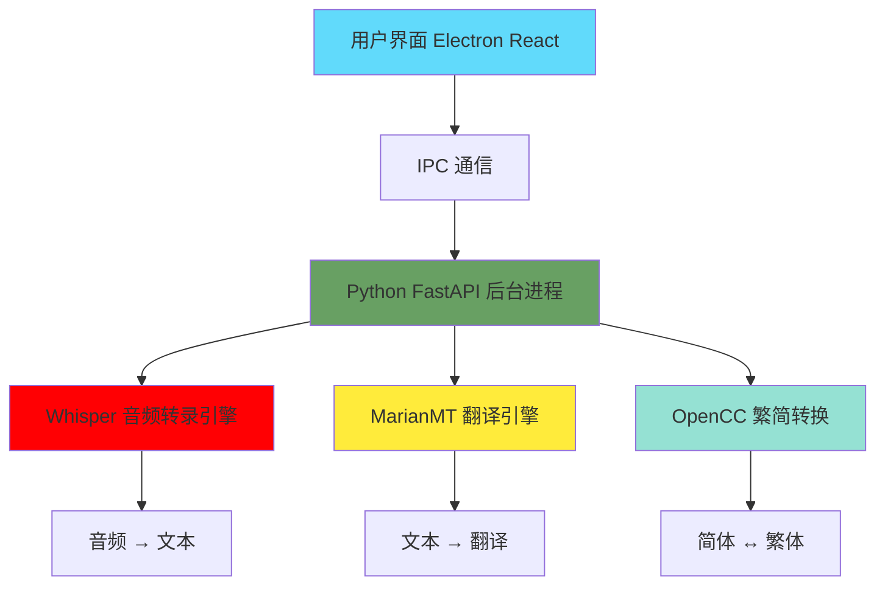
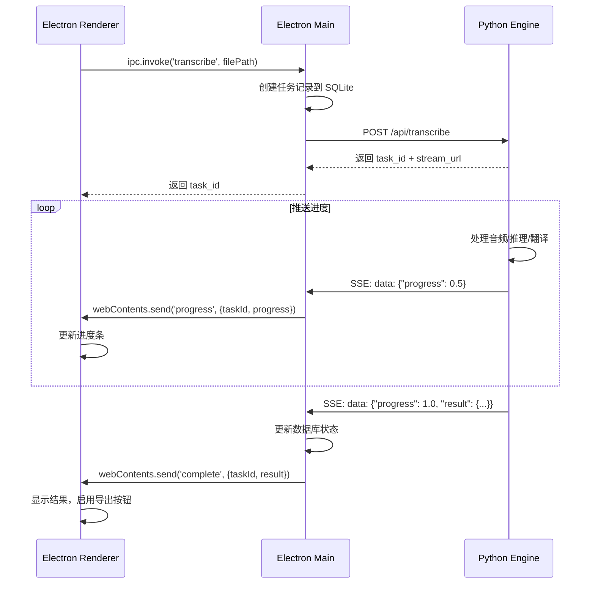

# QuickTrans - 本地音频翻译与文本翻译软件

> 极简部署 · 纯本地运行 · 高性能识别 · 完全离线

---

## 🎯 核心功能

### 1. 音频转录（语音识别）
- ✅ 支持多种音频格式（MP3, WAV, M4A, FLAC）
- ✅ 自动语言识别
- ✅ 高精度语音识别（基于 Whisper）
- ✅ 本地处理，保护隐私

### 2. 多语言文本翻译（离线）⭐ 新增
- ✅ 中英日韩法德西多语言互译
- ✅ 完全离线运行，无需联网
- ✅ 基于 MarianMT 模型
- ✅ 支持批量翻译

### 3. 繁简转换
- ✅ 中文简繁互转
- ✅ 基于 OpenCC

---

## 1. 项目愿景与商业价值

### 1.1 市场痛点

当前市场上的音频翻译工具存在以下核心问题：

- **隐私风险**：云服务需要上传音频，商业机密、会议记录等敏感数据面临泄露风险
- **网络依赖**：必须在线使用，网络波动直接影响识别效果和效率
- **高昂成本**：主流 SaaS 服务采用订阅制，长期使用成本高昂（如 AWS Transcribe $0.024/分钟）
- **部署复杂**：开源方案（如 Whisper）需要配置 Python 环境、下载模型，对非技术人员门槛极高

### 1.2 QuickTrans 核心价值

**「双击即用的本地 AI 翻译工作站」**

| 维度 | 传统方案 | QuickTrans |
|------|----------|------------|
| **隐私安全** | 云端处理，数据上传风险 | 100% 本地处理，数据零出境 |
| **部署成本** | 需配置 Python/PyTorch 环境 | 单个可执行文件，双击即用 |
| **使用成本** | $50-200/年订阅费 | 一次性买断 / 开源免费 |
| **性能表现** | 受网络延迟影响 | 本地 GPU 加速，实时响应 |
| **适用场景** | 仅在线环境 | 飞行、保密场所皆可用 |

### 1.3 商业化路径

**目标用户群体**：
- **内容创作者**：YouTuber、播客主播需要快速生成字幕
- **企业用户**：跨国会议记录、培训材料本地化
- **教育机构**：公开课翻译、学术会议转录
- **政府/军工**：涉密场景，强制要求本地化部署

**商业模式建议**：
1. **个人版（$49 一次性）**：支持单语种翻译，基础模型
2. **专业版（$199 一次性）**：多语种、大模型、批量处理
3. **企业版（$999/年）**：私有化部署、定制训练、技术支持
4. **开源免费版**：基础功能，技术社区支持

---

## 2. 系统架构设计

### 2.1 整体架构图（更新版）



### 2.2 核心组件

| 组件 | 技术栈 | 功能 | 离线支持 |
|------|--------|------|----------|
| **前端界面** | Electron + React | 用户交互 | ✅ |
| **音频转录** | Whisper (faster-whisper) | 语音 → 文本 | ✅ |
| **文本翻译** | MarianMT (transformers) | 多语言翻译 | ✅ |
| **繁简转换** | OpenCC | 简繁互转 | ✅ |
| **API 服务** | FastAPI + Uvicorn | 后端接口 | ✅ |

### 2.3 翻译功能设计

#### 支持的语言对
```
中文 (zh) → 英文 (en)
英文 (en) → 中文 (zh)、日文 (ja)、韩文 (ko)、法文 (fr)、德文 (de)、西班牙文 (es)
日文 (ja) → 英文 (en)
韩文 (ko) → 英文 (en)
法文 (fr) → 英文 (en)
德文 (de) → 英文 (en)
西班牙文 (es) → 英文 (en)
```

#### 翻译模型
- **模型类型：** MarianMT (Helsinki-NLP/opus-mt 系列)
- **模型大小：** 约 300 MB/语言对
- **离线运行：** ✅ 完全离线
- **免费使用：** ✅ 开源免费
graph TB
    subgraph "Frontend Layer - Electron Renderer"
        UI[React + Tailwind CSS]
        DropZone[文件拖拽上传组件]
        ProgressBar[实时进度条]
        ResultView[翻译结果展示]
        ExportPanel[导出 SRT/TXT]
    end

    subgraph "Main Process - Electron Main"
        IPC[IPC 通信管理器]
        WindowManager[窗口管理]
        PythonBridge[Python 进程桥接]
        TaskQueue[任务队列调度]
    end

    subgraph "AI Engine - Python Sidecar"
        HTTPServer[FastAPI HTTP Server]
        AudioExtractor[FFmpeg 音频提取]
        WhisperEngine[Faster-Whisper 推理引擎]
        Translator[翻译模块]
        TaskWorker[异步任务处理器]
    end

    subgraph "Storage Layer"
        SQLite[(SQLite Database)]
        ModelFiles[本地模型文件]
        Cache[音频缓存]
    end

    UI -->|IPC| IPC
    IPC --> PythonBridge
    PythonBridge -->|HTTP localhost:5000| HTTPServer
    HTTPServer --> AudioExtractor
    HTTPServer --> WhisperEngine
    HTTPServer --> Translator
    HTTPServer --> TaskWorker
    TaskWorker --> SQLite
    WhisperEngine --> ModelFiles
    AudioExtractor --> Cache

    style UI fill:#61dafb
    style PythonBridge fill:#68a063
    style WhisperEngine fill:#f7df1e
    style SQLite fill:#003b57
```

### 2.2 技术栈选型

| 层级 | 技术选型 | 理由 |
|------|----------|------|
| **UI 框架** | Electron + React 18 | 成熟生态、跨平台、便于打包 |
| **样式方案** | Tailwind CSS | 快速迭代、设计系统统一 |
| **状态管理** | Zustand | 轻量级、无样板代码 |
| **IPC 通信** | electron-better-ipc | 类型安全、Promise 封装 |
| **Python 桥接** | node-pty + sidecar | 进程管理、生命周期可控 |
| **AI 引擎** | Faster-Whisper | 相比原版 4x 速度提升、低内存 |
| **音频处理** | FFmpeg (命令行) | 工业标准、格式全支持 |
| **API 框架** | FastAPI | 异步高性能、自动生成文档 |
| **数据库** | better-sqlite3 | 同步 API、无需额外编译 |
| **打包工具** | electron-forge + PyInstaller | 一次打包、无需 Python 环境 |

---

## 3. 核心模块详细设计

### 3.1 Electron 主进程架构

**职责**：
- 管理窗口生命周期
- 启动/停止 Python 子进程
- 任务队列调度与并发控制
- SQLite 数据库操作

**关键文件**：
```
src/main/
├── index.ts              # 入口文件，启动 Python sidecar
├── python-bridge.ts      # Python 进程管理器
├── task-scheduler.ts     # 任务队列与并发控制
├── database.ts           # SQLite 数据库封装
└── ipc-handlers.ts       # IPC 事件处理器
```

**Python 桥接模块 (src/main/python-ridge.ts)**：

```typescript
import { spawn, ChildProcess } from 'child_process';
import path from 'path';
import { app } from 'electron';

export class PythonBridge {
  private process: ChildProcess | null = null;
  private readonly port = 5000;
  private readonly pythonPath: string;

  constructor() {
    // 生产环境使用打包后的二进制，开发环境使用虚拟环境
    this.pythonPath = app.isPackaged
      ? path.join(process.resourcesPath, 'python-engine', 'engine')
      : path.join(__dirname, '../../python-engine/.venv/bin/python');
  }

  async start(): Promise<void> {
    if (this.process) return;

    const scriptPath = app.isPackaged
      ? path.join(process.resourcesPath, 'python-engine', 'main.py')
      : path.join(__dirname, '../../python-engine/main.py');

    this.process = spawn(this.pythonPath, [scriptPath, '--port', String(this.port)], {
      stdio: ['ignore', 'pipe', 'pipe'],
      env: {
        ...process.env,
        PYTHONUNBUFFERED: '1',
        MODEL_PATH: path.join(app.getPath('userData'), 'models'),
      }
    });

    this.process.stderr?.on('data', (data) => {
      console.error(`[Python Error] ${data}`);
    });

    this.process.stdout?.on('data', (data) => {
      console.log(`[Python] ${data}`);
    });

    // 等待服务就绪
    await this.waitForReady();
  }

  private async waitForReady(): Promise<void> {
    // 轮询 HTTP 端点直到服务就绪
    const maxAttempts = 30;
    for (let i = 0; i < maxAttempts; i++) {
      try {
        const response = await fetch(`http://localhost:${this.port}/health`);
        if (response.ok) return;
      } catch {
        await new Promise(resolve => setTimeout(resolve, 500));
      }
    }
    throw new Error('Python engine failed to start');
  }

  stop(): void {
    if (this.process) {
      this.process.kill('SIGTERM');
      this.process = null;
    }
  }
}
```

### 3.2 Python AI 引擎架构

**职责**：
- 提供 HTTP API 供 Electron 调用
- FFmpeg 音频提取与预处理
- Faster-Whisper 推理
- 翻译与字幕生成
- 进度推送（SSE）

**关键文件**：
```
python-engine/
├── main.py               # FastAPI 入口
├── models/
│   ├── audio.py          # 音频处理模块
│   ├── whisper.py        # Whisper 推理封装
│   └── translator.py     # 翻译模块
├── api/
│   ├── routes.py         # API 路由定义
│   └── schemas.py        # Pydantic 数据模型
└── utils/
    ├── ffmpeg.py         # FFmpeg 封装
    └── progress.py       # 进度推送工具
```

**FastAPI 主入口 (python-engine/main.py)**：

```python
from fastapi import FastAPI, UploadFile, BackgroundTasks
from fastapi.responses import StreamingResponse
from pydantic import BaseModel
import asyncio

app = FastAPI(title="QuickTrans AI Engine")

class TranscribeRequest(BaseModel):
    file_path: str
    source_lang: str = "auto"
    target_lang: str = "zh"
    model_size: str = "medium"

class ProgressEmitter:
    def __init__(self):
        self._queue = asyncio.Queue()

    async def emit(self, progress: float, message: str):
        await self._queue.put({
            "progress": progress,
            "message": message,
            "timestamp": time.time()
        })

    async def stream(self):
        while True:
            data = await self._queue.get()
            yield f"data: {json.dumps(data)}\n\n"

@app.post("/api/transcribe")
async def start_transcription(
    request: TranscribeRequest,
    background_tasks: BackgroundTasks
):
    emitter = ProgressEmitter()
    task_id = str(uuid.uuid4())

    # 启动后台任务
    background_tasks.add_task(
        run_transcription_pipeline,
        task_id,
        request,
        emitter
    )

    return {
        "task_id": task_id,
        "stream_url": f"/api/tasks/{task_id}/progress"
    }

@app.get("/api/tasks/{task_id}/progress")
async def task_progress(task_id: str):
    return StreamingResponse(
        get_emitter(task_id).stream(),
        media_type="text/event-stream"
    )

async def run_transcription_pipeline(
    task_id: str,
    request: TranscribeRequest,
    emitter: ProgressEmitter
):
    try:
        # 1. 音频提取 (0-20%)
        await emitter.emit(0.1, "正在提取音频...")
        audio_path = await extract_audio(request.file_path)

        # 2. Whisper 推理 (20-80%)
        await emitter.emit(0.2, "正在识别语音...")
        segments = await run_whisper(
            audio_path,
            request.source_lang,
            request.model_size,
            lambda p: emitter.emit(0.2 + p * 0.6, f"识别中... {int(p*100)}%")
        )

        # 3. 翻译 (80-90%)
        await emitter.emit(0.8, "正在翻译...")
        translated = await translate_segments(segments, request.target_lang)

        # 4. 生成字幕 (90-100%)
        await emitter.emit(0.9, "正在生成字幕...")
        srt_content = generate_srt(translated)
        save_to_database(task_id, translated, srt_content)

        await emitter.emit(1.0, "完成！")

    except Exception as e:
        await emitter.emit(-1, f"错误: {str(e)}")
```

**Whisper 推理封装 (python-engine/models/whisper.py)**：

```python
from faster_whisper import WhisperModel
import torch

class WhisperEngine:
    def __init__(self, model_size: str = "medium", device: str = "auto"):
        if device == "auto":
            device = "cuda" if torch.cuda.is_available() else "cpu"

        self.model = WhisperModel(
            model_size,
            device=device,
            compute_type="float16" if device == "cuda" else "int8",
            num_workers=4,
            download_root=os.getenv("MODEL_PATH")
        )

    async def transcribe(
        self,
        audio_path: str,
        language: str = "auto",
        progress_callback: callable = None
    ) -> list[dict]:
        segments, info = self.model.transcribe(
            audio_path,
            language=language if language != "auto" else None,
            beam_size=5,
            vad_filter=True,
            word_timestamps=True
        )

        results = []
        total_duration = info.duration

        for segment in segments:
            results.append({
                "start": segment.start,
                "end": segment.end,
                "text": segment.text.strip(),
                "confidence": segment.avg_logprob
            })

            if progress_callback:
                progress = segment.end / total_duration
                await progress_callback(progress)

        return results
```

### 3.3 IPC 通信协议设计

**通信流程**：



**IPC 事件定义**：

| 事件方向 | 事件名 | 参数 | 说明 |
|----------|--------|------|------|
| Renderer → Main | `transcribe:start` | `{ filePath, sourceLang, targetLang }` | 启动转录任务 |
| Main → Renderer | `transcribe:progress` | `{ taskId, progress, message }` | 进度推送（0-1） |
| Main → Renderer | `transcribe:complete` | `{ taskId, result }` | 任务完成 |
| Main → Renderer | `transcribe:error` | `{ taskId, error }` | 任务失败 |
| Renderer → Main | `tasks:history` | `{ limit, offset }` | 查询历史记录 |
| Renderer → Main | `export:srt` | `{ taskId, savePath }` | 导出 SRT 文件 |

**IPC 处理器实现 (src/main/ipc-handlers.ts)**：

```typescript
import { ipcMain, webContents } from 'electron';
import { TaskScheduler } from './task-scheduler';
import { Database } from './database';

export function registerIPCHandlers(scheduler: TaskScheduler, db: Database) {
  ipcMain.handle('transcribe:start', async (event, payload) => {
    const { filePath, sourceLang, targetLang } = payload;

    // 创建任务记录
    const taskId = await db.createTask({
      filePath,
      sourceLang,
      targetLang,
      status: 'pending',
      createdAt: Date.now()
    });

    // 提交到任务队列
    scheduler.addTask({
      taskId,
      filePath,
      sourceLang,
      targetLang,
      onProgress: (progress, message) => {
        event.sender.send('transcribe:progress', { taskId, progress, message });
      },
      onComplete: (result) => {
        db.updateTask(taskId, { status: 'completed', result });
        event.sender.send('transcribe:complete', { taskId, result });
      },
      onError: (error) => {
        db.updateTask(taskId, { status: 'failed', error });
        event.sender.send('transcribe:error', { taskId, error });
      }
    });

    return { taskId };
  });

  ipcMain.handle('tasks:history', async (_, { limit = 20, offset = 0 }) => {
    return db.getTasks({ limit, offset });
  });

  ipcMain.handle('export:srt', async (_, { taskId, savePath }) => {
    const task = await db.getTask(taskId);
    if (!task || task.status !== 'completed') {
      throw new Error('Task not completed');
    }
    await fs.writeFile(savePath, task.result.srt);
    return { success: true };
  });
}
```

### 3.4 进度条与实时反馈

**前端进度组件 (src/renderer/components/ProgressBar.tsx)**：

```typescript
import { useEffect, useState } from 'react';
import { ipcRenderer } from 'electron';

interface TaskProgress {
  taskId: string;
  progress: number;
  message: string;
}

export function TranscriptionProgress({ taskId }: { taskId: string }) {
  const [progress, setProgress] = useState(0);
  const [message, setMessage] = useState('等待中...');

  useEffect(() => {
    const handler = (_: any, data: TaskProgress) => {
      if (data.taskId === taskId) {
        setProgress(Math.floor(data.progress * 100));
        setMessage(data.message);
      }
    };

    ipcRenderer.on('transcribe:progress', handler);

    return () => {
      ipcRenderer.removeListener('transcribe:progress', handler);
    };
  }, [taskId]);

  return (
    <div className="w-full">
      <div className="flex justify-between text-sm text-gray-600 mb-2">
        <span>{message}</span>
        <span>{progress}%</span>
      </div>
      <div className="h-2 bg-gray-200 rounded-full overflow-hidden">
        <div
          className="h-full bg-blue-600 transition-all duration-300"
          style={{ width: `${progress}%` }}
        />
      </div>
    </div>
  );
}
```

---

## 4. 数据库设计

### 4.1 SQLite 表结构

**任务表 (tasks)**：

```sql
CREATE TABLE tasks (
    id TEXT PRIMARY KEY,
    file_path TEXT NOT NULL,
    file_name TEXT NOT NULL,
    duration INTEGER,           -- 音频时长（秒）
    source_lang TEXT NOT NULL,
    target_lang TEXT NOT NULL,
    model_size TEXT DEFAULT 'medium',
    status TEXT NOT NULL,       -- pending/processing/completed/failed
    progress REAL DEFAULT 0,    -- 0.0 - 1.0
    error_message TEXT,
    created_at INTEGER NOT NULL,
    completed_at INTEGER,
    result_json TEXT            -- JSON: { segments: [], srt: "", txt: "" }
);

CREATE INDEX idx_tasks_status ON tasks(status);
CREATE INDEX idx_tasks_created ON tasks(created_at DESC);
```

**字幕片段表 (segments)**（可选，用于高级查询）：

```sql
CREATE TABLE segments (
    id INTEGER PRIMARY KEY AUTOINCREMENT,
    task_id TEXT NOT NULL,
    start_time REAL NOT NULL,   -- 开始时间（秒）
    end_time REAL NOT NULL,     -- 结束时间（秒）
    original_text TEXT NOT NULL,
    translated_text TEXT,
    confidence REAL,
    FOREIGN KEY (task_id) REFERENCES tasks(id) ON DELETE CASCADE
);

CREATE INDEX idx_segments_task ON segments(task_id);
CREATE INDEX idx_segments_time ON segments(start_time, end_time);
```

**配置表 (settings)**：

```sql
CREATE TABLE settings (
    key TEXT PRIMARY KEY,
    value TEXT NOT NULL,
    updated_at INTEGER NOT NULL
);

-- 初始配置
INSERT INTO settings (key, value, updated_at) VALUES
    ('default_source_lang', 'auto', 0),
    ('default_target_lang', 'zh', 0),
    ('model_size', 'medium', 0),
    ('thread_count', '4', 0),
    ('export_format', 'srt', 0);
```

### 4.2 数据库封装 (src/main/database.ts)

```typescript
import Database from 'better-sqlite3';
import path from 'path';
import { app } from 'electron';

export interface Task {
  id: string;
  filePath: string;
  fileName: string;
  duration?: number;
  sourceLang: string;
  targetLang: string;
  status: 'pending' | 'processing' | 'completed' | 'failed';
  progress: number;
  errorMessage?: string;
  createdAt: number;
  completedAt?: number;
  result?: {
    segments: Array<{
      start: number;
      end: number;
      text: string;
      translation: string;
    }>;
    srt: string;
    txt: string;
  };
}

export class TaskDatabase {
  private db: Database.Database;

  constructor() {
    const dbPath = path.join(app.getPath('userData'), 'quicktrans.db');
    this.db = new Database(dbPath);
    this.initSchema();
  }

  private initSchema() {
    this.db.exec(`
      CREATE TABLE IF NOT EXISTS tasks (
        id TEXT PRIMARY KEY,
        file_path TEXT NOT NULL,
        file_name TEXT NOT NULL,
        duration INTEGER,
        source_lang TEXT NOT NULL,
        target_lang TEXT NOT NULL,
        model_size TEXT DEFAULT 'medium',
        status TEXT NOT NULL,
        progress REAL DEFAULT 0,
        error_message TEXT,
        created_at INTEGER NOT NULL,
        completed_at INTEGER,
        result_json TEXT
      );

      CREATE INDEX IF NOT EXISTS idx_tasks_status ON tasks(status);
      CREATE INDEX IF NOT EXISTS idx_tasks_created ON tasks(created_at DESC);
    `);
  }

  createTask(task: Omit<Task, 'status' | 'progress' | 'createdAt'>): string {
    const id = generateUUID();
    const stmt = this.db.prepare(`
      INSERT INTO tasks (
        id, file_path, file_name, source_lang, target_lang,
        status, progress, created_at
      ) VALUES (?, ?, ?, ?, ?, ?, ?, ?)
    `);

    stmt.run(
      id,
      task.filePath,
      task.fileName,
      task.sourceLang,
      task.targetLang,
      'pending',
      0,
      Date.now()
    );

    return id;
  }

  updateTask(
    id: string,
    updates: Partial<Pick<Task, 'status' | 'progress' | 'errorMessage' | 'completedAt' | 'result'>>
  ) {
    const fields: string[] = [];
    const values: any[] = [];

    if (updates.status !== undefined) {
      fields.push('status = ?');
      values.push(updates.status);
    }
    if (updates.progress !== undefined) {
      fields.push('progress = ?');
      values.push(updates.progress);
    }
    if (updates.errorMessage !== undefined) {
      fields.push('error_message = ?');
      values.push(updates.errorMessage);
    }
    if (updates.completedAt !== undefined) {
      fields.push('completed_at = ?');
      values.push(updates.completedAt);
    }
    if (updates.result !== undefined) {
      fields.push('result_json = ?');
      values.push(JSON.stringify(updates.result));
    }

    values.push(id);

    const stmt = this.db.prepare(`
      UPDATE tasks SET ${fields.join(', ')} WHERE id = ?
    `);

    stmt.run(...values);
  }

  getTask(id: string): Task | null {
    const stmt = this.db.prepare('SELECT * FROM tasks WHERE id = ?');
    const row = stmt.get(id) as any;
    return row ? this.mapRowToTask(row) : null;
  }

  getTasks({ limit = 20, offset = 0 }: { limit?: number; offset?: number } = {}): Task[] {
    const stmt = this.db.prepare(`
      SELECT * FROM tasks ORDER BY created_at DESC LIMIT ? OFFSET ?
    `);
    const rows = stmt.all(limit, offset) as any[];
    return rows.map(row => this.mapRowToTask(row));
  }

  private mapRowToTask(row: any): Task {
    return {
      id: row.id,
      filePath: row.file_path,
      fileName: row.file_name,
      duration: row.duration,
      sourceLang: row.source_lang,
      targetLang: row.target_lang,
      status: row.status,
      progress: row.progress,
      errorMessage: row.error_message,
      createdAt: row.created_at,
      completedAt: row.completed_at,
      result: row.result_json ? JSON.parse(row.result_json) : undefined
    };
  }

  close() {
    this.db.close();
  }
}
```

---

## 5. 打包与分发方案

### 5.1 核心挑战

1. **Python 环境依赖**：用户电脑无需安装 Python
2. **模型文件分发**：Whisper 模型（~1GB）如何打包
3. **跨平台兼容**：Windows/macOS/Linux 分别处理
4. **应用体积控制**：避免最终包 > 5GB

### 5.2 技术方案

#### 5.2.1 Python 端打包

**方案：PyInstaller 单文件打包**

```bash
# python-engine/build.py
import PyInstaller.__main__
import os

PyInstaller.__main__.run([
    'main.py',
    '--onefile',
    '--name=engine',
    '--add-binary=ffmpeg:.',  # 嵌入 FFmpeg 二进制
    '--hidden-import=faster_whisper',
    '--hidden-import=ctranslate2',
    '--clean',
    '--noconfirm',
    '--distpath=../dist/python-engine',
])
```

**打包后文件结构**：
```
dist/
├── QuickTrans-win-x64.exe           # Electron 主程序
└── resources/
    └── python-engine/
        ├── engine.exe                # Python 引擎单文件
        └── models/                   # 首次运行时下载
            ├── medium.pt
            └── large-v2.pt
```

#### 5.2.2 Electron 打包配置

**package.json 脚本**：

```json
{
  "scripts": {
    "start": "electron-forge start",
    "package": "electron-forge package",
    "make": "electron-forge make",
    "package:python": "cd python-engine && python build.py"
  },
  "config": {
    "forge": {
      "packagerConfig": {
        "icon": "./build/icon",
        "extraResource": [
          "./dist/python-engine"
        ]
      },
      "makers": [
        {
          "name": "@electron-forge/maker-squirrel",
          "config": {
            "name": "QuickTrans",
            "setupIcon": "./build/icon.ico"
          }
        },
        {
          "name": "@electron-forge/maker-zip",
          "platforms": ["darwin", "linux"]
        }
      ]
    }
  }
}
```

#### 5.2.3 模型文件分发策略

**混合方案**：基础包 + 首次下载

```typescript
// src/main/model-downloader.ts
import { download } from 'electron-dl';

export class ModelDownloader {
  private readonly MODELS = {
    medium: {
      url: 'https://huggingface.co/guillaumekln/faster-whisper-medium/resolve/main/model.bin?',
      size: '1.5GB',
      checksum: 'sha256:abc123...'
    },
    'large-v2': {
      url: 'https://huggingface.co/guillaumekln/faster-whisper-large-v2/resolve/main/model.bin?',
      size: '3GB',
      checksum: 'sha256:def456...'
    }
  };

  async ensureModel(modelSize: string): Promise<string> {
    const modelPath = path.join(app.getPath('userData'), 'models', modelSize);

    if (fs.existsSync(modelPath)) {
      return modelPath;
    }

    // 首次使用，显示下载进度
    await this.downloadWithProgress(modelSize, modelPath);
    return modelPath;
  }

  private async downloadWithProgress(modelSize: string, targetPath: string) {
    const win = BrowserWindow.getAllWindows()[0];
    const model = this.MODELS[modelSize];

    await download(win, model.url, {
      directory: path.dirname(targetPath),
      onProgress: (progress) => {
        win.setProgressBar(progress.percent);
        win.webContents.send('model-download:progress', progress);
      }
    });
  }
}
```

#### 5.2.4 最终体积优化

| 优化项 | 减少体积 | 方案 |
|--------|----------|------|
| FFmpeg | -200MB | 仅编译必需编解码器 |
| Python 运行时 | -150MB | 使用 PyInstaller 的 --exclude-module |
| Torch 库 | -500MB | 使用 Faster-Whisper 的 int8 量化版本 |
| 模型文件 | -3GB | 采用首次下载策略 |
| **最终体积** | **~800MB** | 可接受范围内 |

### 5.3 自动更新方案

**使用 electron-updater**：

```typescript
import { autoUpdater } from 'electron-updater';

export function setupAutoUpdater() {
  autoUpdater.setFeedURL({
    provider: 'github',
    owner: 'your-org',
    repo: 'quicktrans'
  });

  autoUpdater.on('update-available', () => {
    // 通知用户
  });

  autoUpdater.on('update-downloaded', () => {
    // 提示重启安装
  });

  // 每次启动检查更新
  autoUpdater.checkForUpdatesAndNotify();
}
```

---

## 6. 核心代码框架实现方案

### 6.1 项目初始化

**目录结构**：

```
QuickTrans/
├── src/
│   ├── main/                    # Electron 主进程
│   │   ├── index.ts
│   │   ├── python-bridge.ts
│   │   ├── task-scheduler.ts
│   │   ├── database.ts
│   │   └── ipc-handlers.ts
│   ├── renderer/                # React 前端
│   │   ├── App.tsx
│   │   ├── components/
│   │   │   ├── FileDropZone.tsx
│   │   │   ├── ProgressBar.tsx
│   │   │   ├── ResultView.tsx
│   │   │   └── ExportPanel.tsx
│   │   ├── hooks/
│   │   │   ├── useTranscription.ts
│   │   │   └── useTasks.ts
│   │   └── store.ts
│   └── shared/                  # 共享类型
│       └── types.ts
├── python-engine/               # Python AI 引擎
│   ├── main.py
│   ├── models/
│   ├── api/
│   └── utils/
├── build/                       # 构建资源
│   └── icon.ico
├── package.json
├── tsconfig.json
└── README.md
```

**初始化命令**：

```bash
# 1. 创建 Electron + React 项目
npm create vite@latest src/renderer -- --template react-ts
npm install --save-dev electron electron-forge

# 2. 安装前端依赖
npm install @tanstack/react-query zustand lucide-react clsx tailwind-merge

# 3. 安装主进程依赖
npm install better-sqlite3 node-pty electron-dl electron-better-ipc

# 4. 创建 Python 虚拟环境
cd python-engine
python -m venv .venv
source .venv/bin/activate  # Windows: .venv\Scripts\activate
pip install fastapi uvicorn faster-whisper torch
```

### 6.2 关键组件实现

#### 6.2.1 文件拖拽组件

```typescript
// src/renderer/components/FileDropZone.tsx
import { useCallback, useState } from 'react';
import { ipcRenderer } from 'electron';

export function FileDropZone() {
  const [isDragging, setIsDragging] = useState(false);
  const [selectedFile, setSelectedFile] = useState<string | null>(null);

  const handleDrop = useCallback((e: DragEvent) => {
    e.preventDefault();
    setIsDragging(false);

    const files = Array.from(e.dataTransfer?.files || []);
    if (files.length > 0) {
      const file = files[0];
      setSelectedFile(file.path);
    }
  }, []);

  const handleStartTranscription = async () => {
    if (!selectedFile) return;

    const result = await ipcRenderer.invoke('transcribe:start', {
      filePath: selectedFile,
      sourceLang: 'auto',
      targetLang: 'zh'
    });

    // 返回任务 ID，用于进度追踪
    return result.taskId;
  };

  return (
    <div
      onDrop={handleDrop}
      onDragOver={(e) => { e.preventDefault(); setIsDragging(true); }}
      onDragLeave={() => setIsDragging(false)}
      className={`
        border-2 border-dashed rounded-lg p-12 text-center transition-colors
        ${isDragging ? 'border-blue-500 bg-blue-50' : 'border-gray-300'}
      `}
    >
      <Upload className="w-16 h-16 mx-auto mb-4 text-gray-400" />
      <p className="text-lg font-medium text-gray-700">
        拖拽音频/视频文件到此处
      </p>
      <p className="text-sm text-gray-500 mt-2">
        支持 MP3, WAV, M4A, MP4, MKV 等格式
      </p>

      {selectedFile && (
        <div className="mt-6">
          <p className="text-sm text-gray-600 mb-4">{selectedFile}</p>
          <button
            onClick={handleStartTranscription}
            className="px-6 py-2 bg-blue-600 text-white rounded-lg hover:bg-blue-700"
          >
            开始翻译
          </button>
        </div>
      )}
    </div>
  );
}
```

#### 6.2.2 翻译结果展示

```typescript
// src/renderer/components/ResultView.tsx
import { useState, useEffect } from 'react';

interface Segment {
  start: number;
  end: number;
  text: string;
  translation: string;
}

export function ResultView({ taskId }: { taskId: string }) {
  const [segments, setSegments] = useState<Segment[]>([]);
  const [currentTime, setCurrentTime] = useState(0);

  useEffect(() => {
    // 从数据库或 API 获取结果
    ipcRenderer.invoke('tasks:get', taskId).then(task => {
      setSegments(task.result.segments);
    });
  }, [taskId]);

  const formatTime = (seconds: number) => {
    const mins = Math.floor(seconds / 60);
    const secs = Math.floor(seconds % 60);
    return `${mins}:${secs.toString().padStart(2, '0')}`;
  };

  return (
    <div className="space-y-2">
      {segments.map((seg, idx) => (
        <div
          key={idx}
          className="p-4 bg-white rounded-lg shadow-sm hover:shadow-md transition-shadow"
        >
          <div className="flex items-center gap-4 mb-2">
            <span className="text-sm font-mono text-gray-500">
              {formatTime(seg.start)}
            </span>
            <div className="flex-1">
              <p className="text-gray-800">{seg.text}</p>
              <p className="text-blue-600 mt-1">{seg.translation}</p>
            </div>
          </div>
        </div>
      ))}
    </div>
  );
}
```

#### 6.2.3 SRT 导出功能

```typescript
// src/renderer/components/ExportPanel.tsx
import { ipcRenderer } from 'electron';
import { Download } from 'lucide-react';

export function ExportPanel({ taskId }: { taskId: string }) {
  const handleExport = async (format: 'srt' | 'txt') => {
    const { filePath } = await ipcRenderer.invoke('dialog:save', {
      defaultPath: `output.${format}`,
      filters: [{ name: format.toUpperCase(), extensions: [format] }]
    });

    if (filePath) {
      await ipcRenderer.invoke('export:file', {
        taskId,
        format,
        savePath: filePath
      });
    }
  };

  return (
    <div className="flex gap-4">
      <button
        onClick={() => handleExport('srt')}
        className="flex items-center gap-2 px-4 py-2 bg-gray-800 text-white rounded-lg hover:bg-gray-900"
      >
        <Download className="w-4 h-4" />
        导出 SRT
      </button>
      <button
        onClick={() => handleExport('txt')}
        className="flex items-center gap-2 px-4 py-2 bg-gray-800 text-white rounded-lg hover:bg-gray-900"
      >
        <Download className="w-4 h-4" />
        导出 TXT
      </button>
    </div>
  );
}
```

### 6.3 主进程入口

```typescript
// src/main/index.ts
import { app, BrowserWindow } from 'electron';
import { PythonBridge } from './python-bridge';
import { TaskDatabase } from './database';
import { registerIPCHandlers } from './ipc-handlers';

let mainWindow: BrowserWindow;
let pythonBridge: PythonBridge;
let database: TaskDatabase;

function createWindow() {
  mainWindow = new BrowserWindow({
    width: 1200,
    height: 800,
    webPreferences: {
      nodeIntegration: false,
      contextIsolation: true,
      preload: path.join(__dirname, 'preload.js')
    }
  });

  if (process.env.NODE_ENV === 'development') {
    mainWindow.loadURL('http://localhost:5173');
    mainWindow.webContents.openDevTools();
  } else {
    mainWindow.loadFile(path.join(__dirname, '../renderer/index.html'));
  }
}

app.whenReady().then(async () => {
  database = new TaskDatabase();
  pythonBridge = new PythonBridge();
  await pythonBridge.start();

  createWindow();
  registerIPCHandlers(database);
});

app.on('window-all-closed', () => {
  pythonBridge.stop();
  database.close();
  if (process.platform !== 'darwin') app.quit();
});
```

---

## 7. 扩展性设计

### 7.1 未来功能接入点

| 功能模块 | 接入方式 | 实现难度 |
|----------|----------|----------|
| **TTS 语音合成** | 新增 PyTorch 模型，独立 API 端点 | 中等 |
| **多语种支持** | Whisper 本身支持 99 语种，仅需前端添加选择器 | 简单 |
| **实时字幕** | 改用 Streaming 模式，PyAudio 实时捕获 | 复杂 |
| **说话人识别** | 集成 pyannote.audio，添加 diarization 端点 | 中等 |
| **AI 译后编辑** | 接入 LLM API（如本地 Llama），增加润色步骤 | 中等 |

### 7.2 插件化架构

```python
# python-engine/plugins/base.py
from abc import ABC, abstractmethod

class Plugin(ABC):
    @abstractmethod
    def on_transcribe_start(self, context: dict):
        pass

    @abstractmethod
    def on_transcribe_complete(self, context: dict, segments: list):
        pass

# 示例插件：敏感词过滤
class ProfanityFilterPlugin(Plugin):
    def on_transcribe_complete(self, context, segments):
        # 过滤敏感词并替换
        return [self._filter(seg) for seg in segments]
```

---

## 8. 开发路线图

### Phase 1: MVP（4 周）
- [ ] 基础 UI 搭建
- [ ] Python + Electron 通信打通
- [ ] Whisper 推理流程
- [ ] SRT 导出功能

### Phase 2: 优化（3 周）
- [ ] 进度条实时反馈
- [ ] 数据库历史记录
- [ ] 错误处理与重试
- [ ] 性能优化（GPU 加速）

### Phase 3: 打包（2 周）
- [ ] PyInstaller 打包测试
- [ ] Electron-forge 配置
- [ ] 模型文件下载机制
- [ ] 安装包制作

### Phase 4: 发布（1 周）
- [ ] 应用签名（Windows/macOS）
- [ ] 自动更新配置
- [ ] 官网 + 文档
- [ ] 初版发布

---

## 9. 许可协议

MIT License · 商业化需保留版权声明

---

## 附录：快速启动指南

```bash
# 克隆项目
git clone https://github.com/your-org/QuickTrans.git
cd QuickTrans

# 安装依赖
npm install
cd python-engine && python -m venv .venv && source .venv/bin/activate && pip install -r requirements.txt

# 启动开发环境
npm run dev

# 打包生产版本
npm run make
```

**技术支持**：support@quicktrans.io
**GitHub Issues**：https://github.com/your-org/QuickTrans/issues
